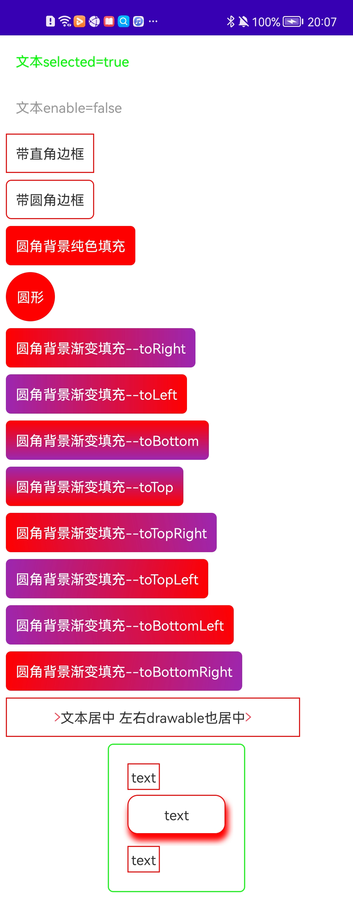

### 使用方式

```
dependencies {
    ...
    implementation 'com.melot.android:baseView:1.0.0'
    ...
}

```



### 属性解析

#### 通用属性

    * border_width：线框宽度
    * border_radius：圆角 (背景与线框都适用)
    * border_radius_top_left：上左圆角
    * border_radius_top_right：上右圆角
    * border_radius_bottom_left：下左圆角
    * border_radius_bottom_right：下右圆角
    * border_color：线框颜色
    * gradient_direction: 渐变方向
    * gradient_startColor: 渐变初始颜色
    * gradient_endColor：渐变终止颜色
    enable = false 状态下的属性
    * disable_color：
    * disable_border_width
    * disable_border_radius
    * disable_border_radius_top_left
    * disable_border_radius_top_right
    * disable_border_radius_bottom_left
    * disable_border_radius_bottom_right
    * disable_border_color
    * disable_gradient_direction
    * disable_gradient_startColor
    * disable_gradient_endColor
    selected = true 状态下的属性
    * selected_color
    * selected_border_width
    * selected_border_radius
    * selected_border_radius_top_left
    * selected_border_radius_top_right
    * selected_border_radius_bottom_left
    * selected_border_radius_bottom_right
    * selected_border_color
    * selected_gradient_direction
    * selected_gradient_startColor
    * selected_gradient_endColor
    阴影属性
    * shadow_xoffset
    * shadow_yoffset
    * shadow_blur
    * shadow_spread
    * shadow_color
    * shadow_radius

#### TextView 专有属性

    * disable_text_color:  enable = false 的字体颜色
    * selected_text_color：selected = true 的字体颜色
    * font_weight
    * bold_style
    * text_shadow_layer_radius
    * text_shadow_layer_dx
    * text_shadow_layer_dy
    * text_shadow_layer_color
